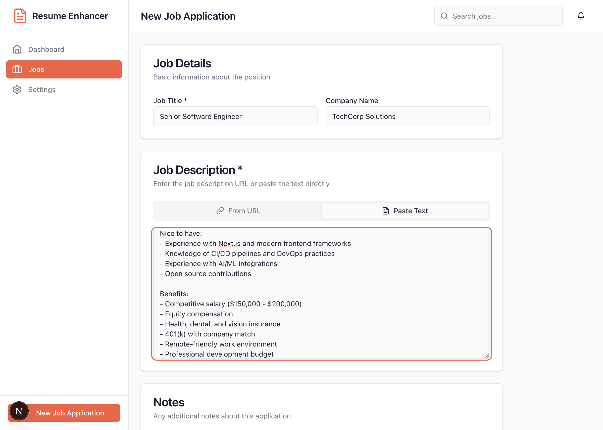
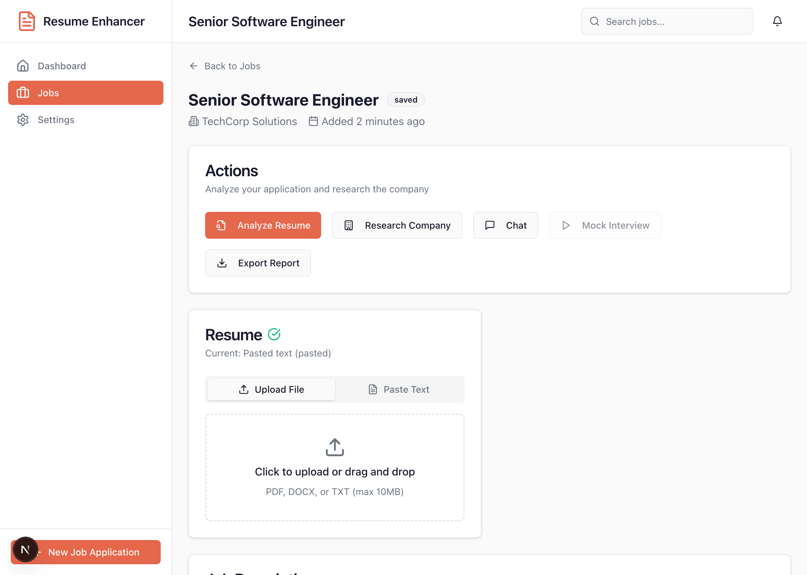
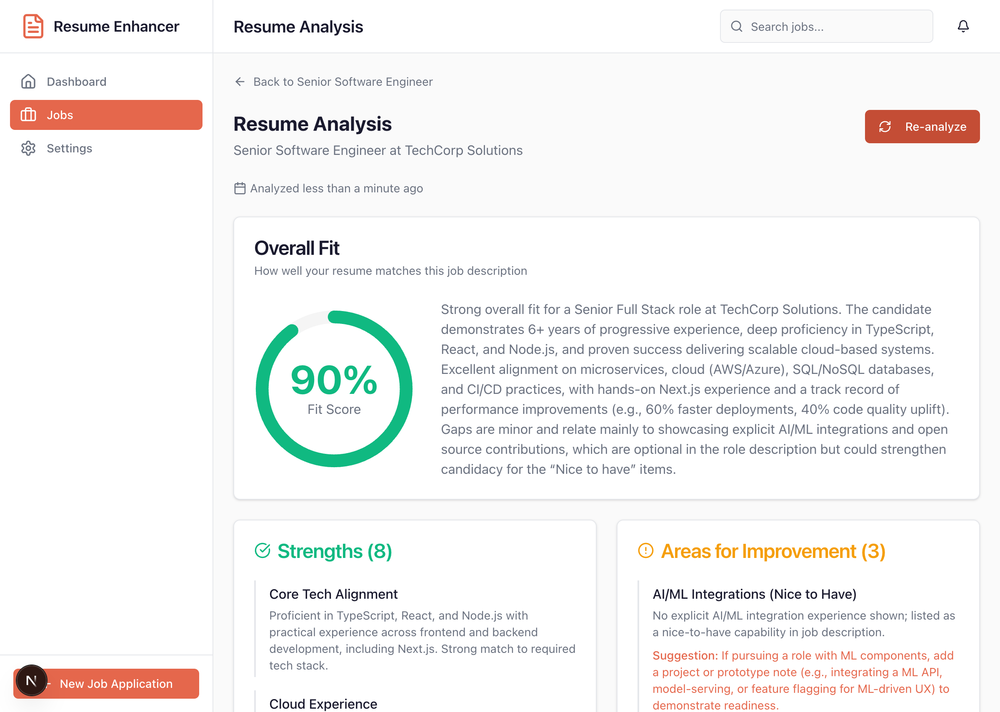
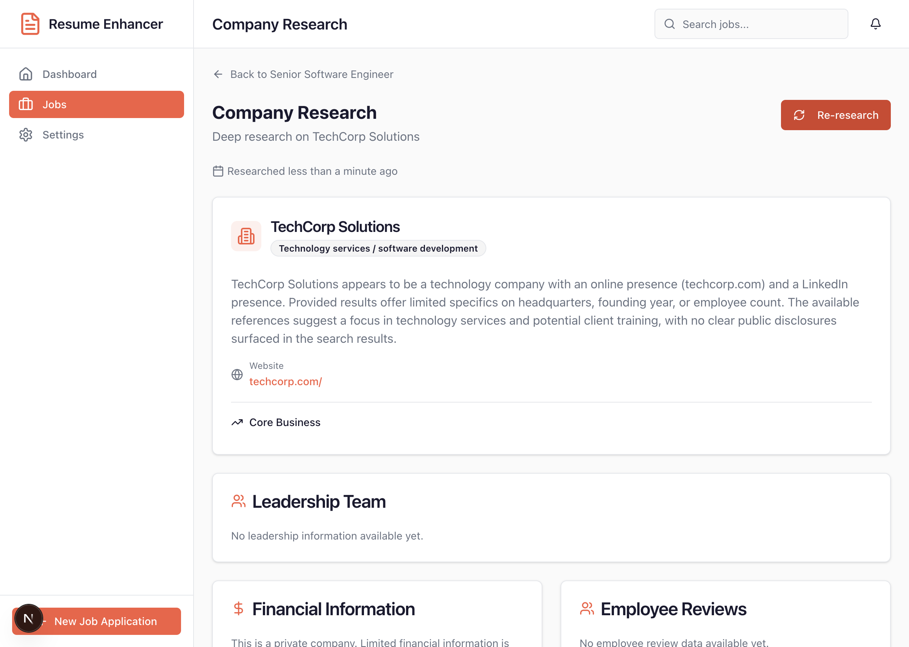
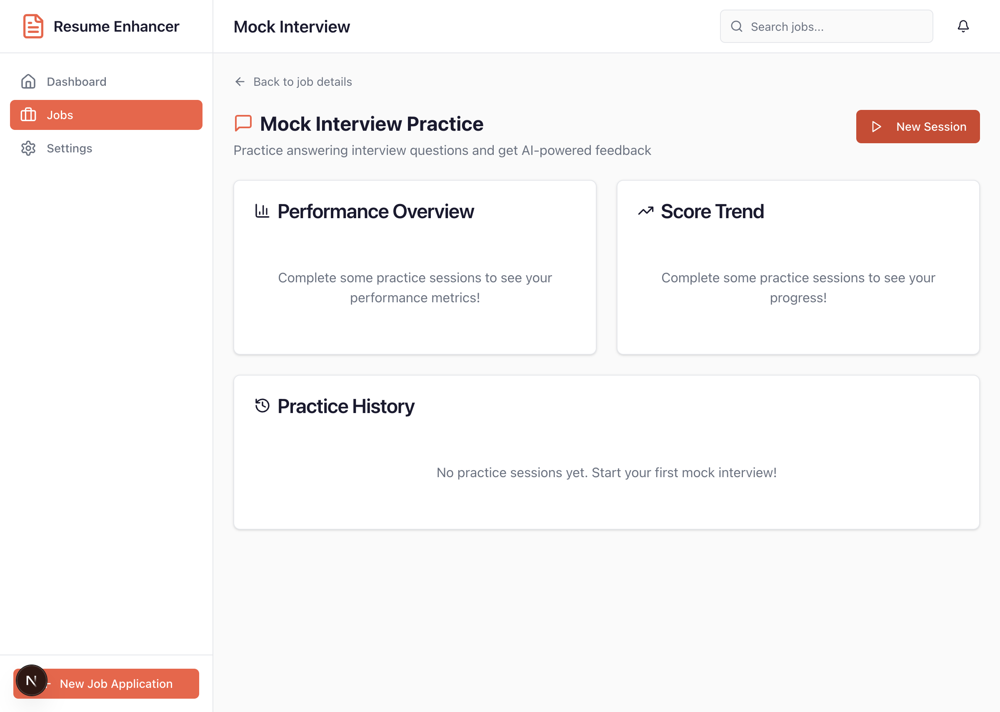
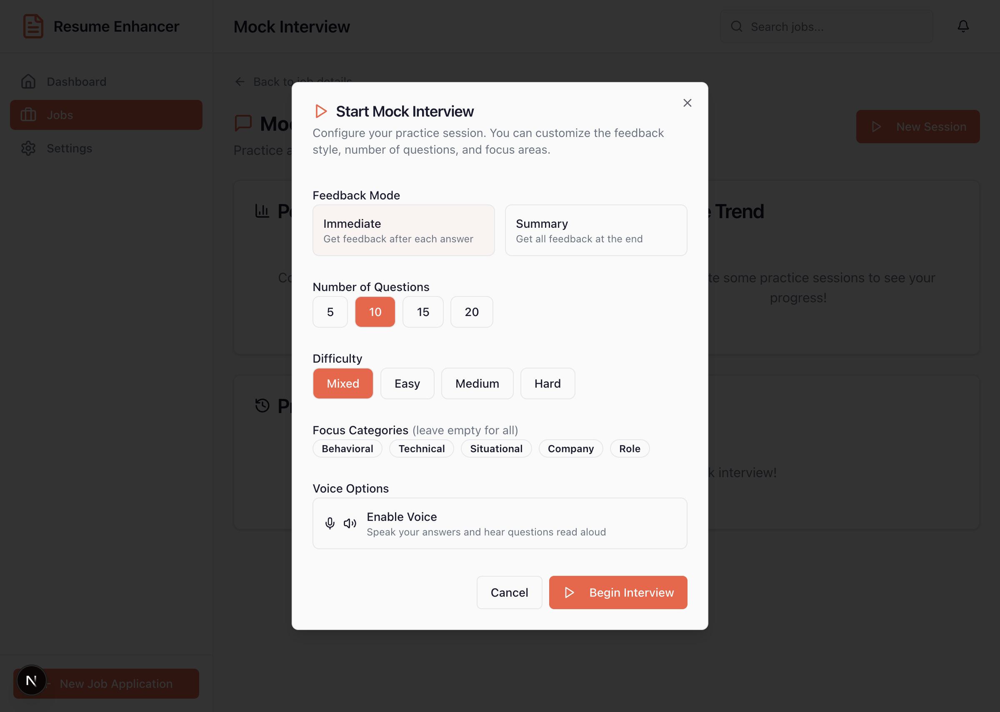
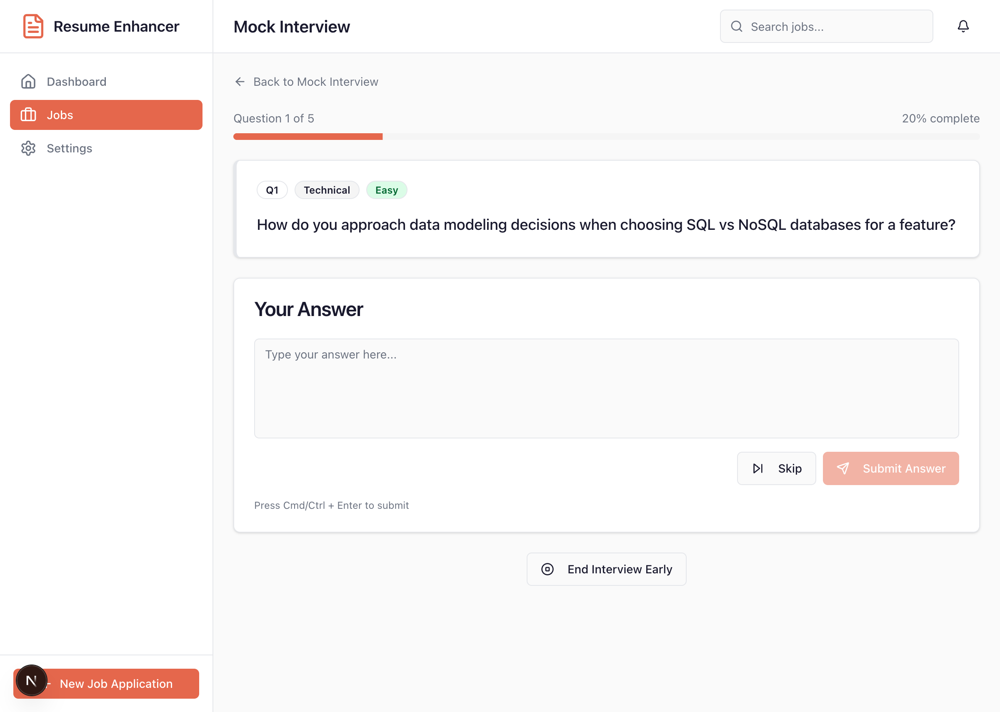
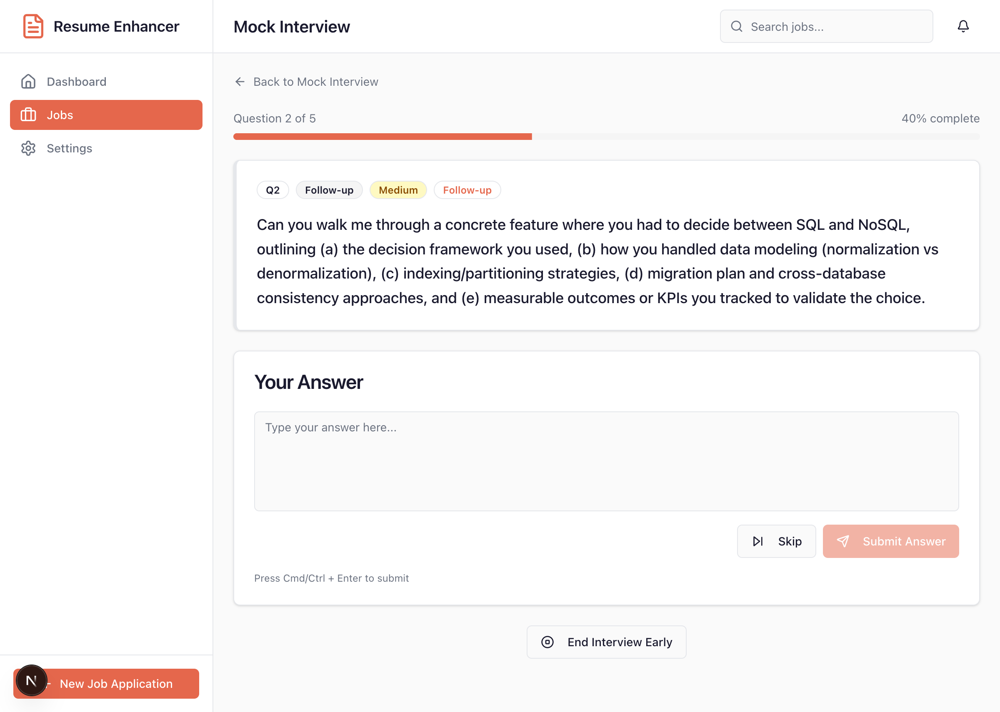
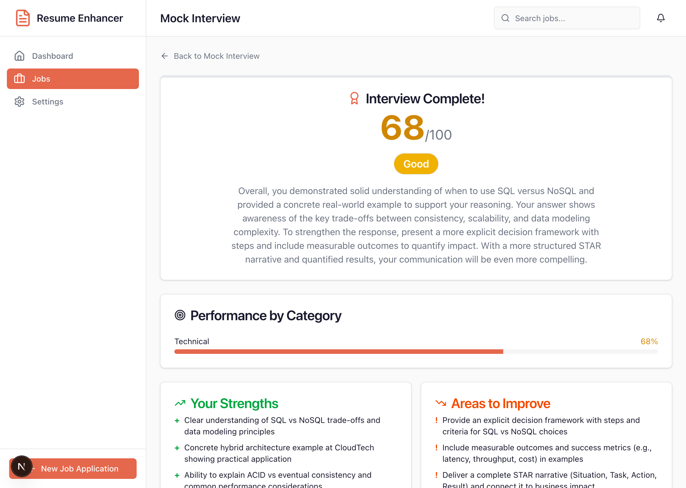

# Job Resume Enhancer

A personal job search tool that analyzes your resume against job postings and deeply researches companies before applying. Built with Next.js, Azure OpenAI, and Anthropic-inspired design.

## Features

### Resume Analysis
- Upload resume (PDF, DOCX, TXT) or paste text directly
- Enter job description URL (auto-scrapes) or paste text
- Get a 0-100% fit score with detailed breakdown
- View strengths and areas for improvement
- Receive specific enhancement suggestions with before/after text
- Identify skill gaps with actionable recommendations
- Generate 15-20 likely interview questions with suggested answers

### Company Research
- Deep dive into any company using Brave Search API (with DuckDuckGo fallback)
- Leadership team profiles (CEO, executives, board members)
- Financial information (revenue, market cap, growth trends)
- Employee reviews and culture insights (Glassdoor-style)
- Recent news with sentiment analysis
- Legal issues and regulatory concerns
- Ethics alignment scoring

### Chat Assistant
- Conversational interface with your saved research data
- Ask follow-up questions about analysis or company research
- Markdown-rendered responses with bullet points, lists, and formatting
- Session management for multiple conversations per job

### Mock Interview Practice
- Practice answering interview questions generated from your resume analysis
- Choose between immediate feedback or summary-at-end modes
- Select number of questions (5-20), difficulty, and focus categories
- AI-powered evaluation with STAR method analysis
- Detailed scoring (0-100) with strengths and improvement areas
- Dynamic follow-up questions based on your answers
- Session summaries with practice recommendations
- Voice input/output support (Web Speech API)

### Application Tracking
- Manage multiple job applications in one dashboard
- Track status: Saved → Analyzing → Applied → Interviewing → Offered
- Export reports as JSON or Markdown

## Tech Stack

| Layer | Technology |
|-------|------------|
| Framework | Next.js 16+ (App Router) + TypeScript |
| AI | Azure OpenAI (gpt-5.2 deployment) |
| Database | SQLite + Drizzle ORM |
| Web Search | Brave Search API (primary) + DuckDuckGo (fallback) |
| UI | Tailwind CSS v4 + shadcn/ui + Anthropic brand colors |
| Testing | Vitest + React Testing Library |

## Getting Started

### Prerequisites

- Node.js 18+
- Azure OpenAI API access with a gpt-5.2 (or compatible) deployment
- Brave Search API key (optional, falls back to DuckDuckGo)

### Installation

```bash
# Clone the repository
git clone https://github.com/robfosterdotnet/Job-ResumeEnhancer.git
cd Job-ResumeEnhancer

# Install dependencies
npm install

# Set up environment variables
cp .env.example .env
# Edit .env with your API credentials

# Initialize the database
npm run db:push

# Start the development server
npm run dev
```

### Environment Variables

Create a `.env` file with the following:

```bash
# Azure OpenAI
AZURE_OPENAI_ENDPOINT=https://your-resource.openai.azure.com/
AZURE_OPENAI_API_KEY=your-api-key
AZURE_OPENAI_DEPLOYMENT=gpt-5.2
AZURE_OPENAI_API_VERSION=2024-07-01-preview

# Database
DATABASE_URL=file:./data/resume-enhancer.db

# Web Search (optional - falls back to DuckDuckGo if not set)
BRAVE_SEARCH_API_KEY=your-brave-api-key
```

## Application Walkthrough

### 1. Create a New Job Application

Start by clicking "New Job Application" from the sidebar. Enter the job title, company name, and paste the job description.



### 2. Upload Your Resume

After creating the job, you'll see the job detail page. Upload your resume (PDF, DOCX, or TXT) or paste the text directly.



### 3. Analyze Your Resume

Click "Analyze Resume" to get AI-powered insights on how well your resume matches the job description.



The analysis includes:
- **Fit Score** (0-100%) - How well your resume matches the job
- **Strengths** - What you're doing well
- **Areas for Improvement** - Specific suggestions to improve
- **Enhancement Suggestions** - Before/after text improvements
- **Keyword Analysis** - Matched and missing keywords
- **Interview Questions** - Likely questions with suggested answers

### 4. Research the Company

Click "Research Company" to gather detailed information about the company using web search.



Company research includes:
- Company overview and industry
- Leadership team profiles
- Financial information
- Employee reviews and culture
- Recent news with sentiment analysis
- Legal issues and regulatory concerns
- Ethics alignment scoring

### 5. Practice with Mock Interviews

Click "Mock Interview" to practice answering interview questions with AI-powered feedback.



Configure your practice session with feedback mode, number of questions, difficulty, and focus categories.



Answer questions and receive immediate feedback with STAR method analysis.



The AI evaluates your answers based on:
- Relevance and structure
- STAR method components (Situation, Task, Action, Result)
- Key points covered and missed
- Specific improvement suggestions



At the end of your session, get a comprehensive summary with overall score, strengths, areas to improve, and practice recommendations.



## Quick Start Usage

1. **Create a Job Application** - Click "New Job Application" and enter the job details

2. **Upload Your Resume** - On the job detail page, upload your resume file or paste the text

3. **Run Resume Analysis** - Click "Analyze Resume" to get your fit score and interview questions

4. **Research the Company** - Click "Research Company" to gather company intelligence

5. **Practice Interviews** - Click "Mock Interview" to practice with AI feedback

6. **Chat with Your Data** - Use the chat interface for follow-up questions

7. **Export Reports** - Download your analysis and research as JSON or Markdown files

## Project Structure

```
Job-ResumeEnhancer/
├── app/
│   ├── (dashboard)/          # Dashboard pages (route group)
│   │   ├── page.tsx          # Main dashboard
│   │   ├── jobs/
│   │   │   ├── page.tsx      # Jobs list
│   │   │   ├── new/          # New job form
│   │   │   └── [jobId]/      # Job detail & sub-pages
│   │   │       ├── resume-analysis/
│   │   │       ├── company-research/
│   │   │       ├── chat/
│   │   │       └── mock-interview/
│   │   └── layout.tsx        # Dashboard layout with sidebar
│   └── api/
│       ├── agents/           # AI agent endpoints (streaming)
│       ├── jobs/             # CRUD operations
│       ├── chat/             # Chat endpoint
│       ├── export/           # Report generation
│       ├── scrape/           # URL scraping
│       └── parse/            # Document parsing
├── components/
│   ├── ui/                   # Base UI components
│   ├── analysis/             # Resume analysis views
│   ├── research/             # Company research views
│   ├── chat/                 # Chat interface
│   ├── mock-interview/       # Mock interview components
│   ├── dashboard/            # Layout components
│   └── jobs/                 # Job management
├── lib/
│   ├── db/                   # Drizzle schema & connection
│   ├── ai/                   # Azure OpenAI client & agents
│   ├── parsers/              # PDF, DOCX, TXT parsing
│   └── scrapers/             # Web scraping utilities
└── __tests__/                # Test files
```

## Development

```bash
# Start development server
npm run dev

# Run tests
npm run test

# Run tests in watch mode
npm run test:watch

# Run a single test file
npx vitest run __tests__/components/analysis/fit-score-gauge.test.tsx

# Lint code
npm run lint

# Build for production
npm run build

# Database management
npm run db:push      # Push schema changes
npm run db:studio    # Open Drizzle Studio
```

## API Endpoints

| Method | Endpoint | Description |
|--------|----------|-------------|
| GET/POST | `/api/jobs` | List/create job applications |
| GET/PUT/DELETE | `/api/jobs/[jobId]` | Job CRUD operations |
| POST | `/api/jobs/[jobId]/resume` | Upload resume |
| POST | `/api/agents/resume-analyzer` | Run resume analysis (streaming) |
| POST | `/api/agents/company-research` | Run company research (streaming) |
| POST | `/api/agents/mock-interviewer` | Mock interview agent (streaming) |
| GET/POST | `/api/mock-interview/sessions` | List/create interview sessions |
| GET/PATCH/DELETE | `/api/mock-interview/sessions/[sessionId]` | Session operations |
| GET | `/api/mock-interview/analytics` | Performance metrics |
| POST | `/api/chat` | Chat with saved data (streaming) |
| POST | `/api/scrape` | Scrape job description URL |
| POST | `/api/parse` | Parse uploaded document |
| POST | `/api/export` | Generate report (JSON/Markdown) |

## Design

The UI uses Anthropic's brand colors:

- **Primary**: #E5674C (Coral)
- **Background**: #FAFAFA
- **Foreground**: #1A1A2E (Dark navy)
- **Success**: #10B981
- **Warning**: #F59E0B
- **Error**: #EF4444

## Documentation

- **SPECIFICATION.md** - Complete technical specification with implementation details
- **CLAUDE.md** - AI assistant guidance for working with this codebase

## License

MIT
